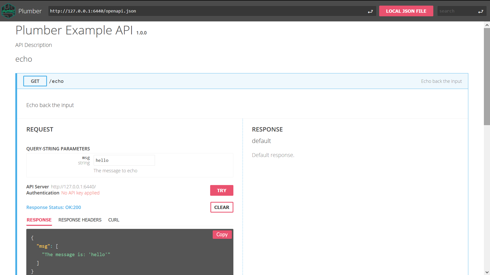

<!-- badges: start -->
[](https://cran.r-project.org/package=rapidoc)
[](https://github.com/meztez/rapidoc/actions)
[](https://community.rstudio.com/tag/rapidoc)
<!-- badges: end -->

RapiDoc is a collection of ‘HTML’, ‘JavaScript’, ‘CSS’ and fonts assets that generate ‘RapiDoc’ documentation from an OpenAPI Specification.

The main purpose of this package is to enable package authors to create APIs that are compatible with [RapiDoc](https://mrin9.github.io/RapiDoc/) and [openapis.org](https://www.openapis.org/).

Package authors providing web interfaces can serve the static files from `rapidoc_path()` using [httpuv](https://github.com/rstudio/httpuv) or [fiery](https://github.com/thomasp85/fiery). As a start, we can also browse them by running

```{r eval=FALSE}
library(rapidoc)
browseURL(rapidoc_index())
```



To learn more about 'RapiDoc' visit: [RapiDoc](https://mrin9.github.io/RapiDoc/)
